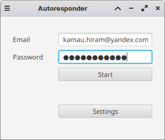
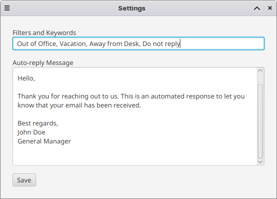

# AutoResponder

Utilizes the Jakarta Mail API and JavaFX to provide an automated email response solution.

The app connects to an email account, monitors incoming messages, and sends predefined auto-reply messages

## Features

- Auto-reply to incoming emails with custom messages.
- User-friendly JavaFX interface.
- Supports SSL/TLS for secure communication.

##### App view

##### Settings view

## Getting Started

1. Clone this repository.
2. Open the project in your favorite Java IDE.
3. Configure your email account settings in the code.
4. Build and run the application.

## Usage

1. Launch the app.
2. Enter your email credentials to connect to your email account.
3. Configure auto-reply settings, including message and filters.
4. Start the autoresponder to begin automatic responses.
5. Stop the autoresponder at any time.

## Dependencies

-  Jakarta Mail API: [Jakarta Mail Spec](https://jakarta.ee/specifications/mail/2.0/jakarta-mail-spec-2.0.html)
- JavaFX: [OpenJFX](https://openjfx.io/)

